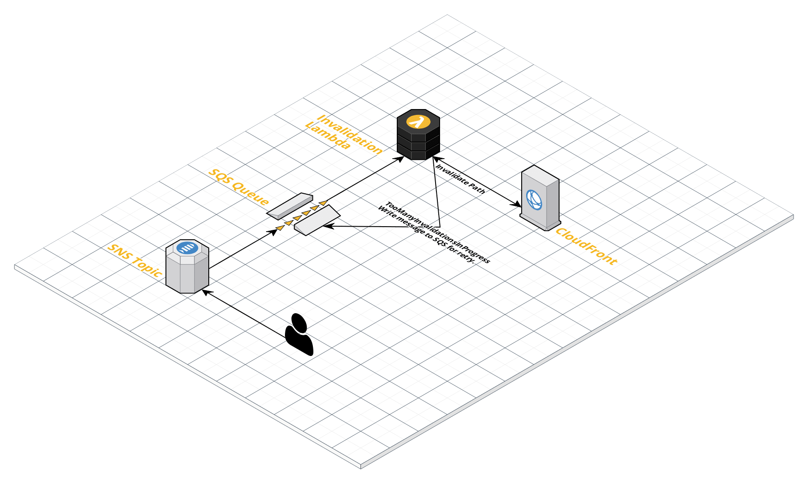

# terraform-aws-cloudfront-invalidation

The CloudFront Invalidator provides a retry mechanism for invalidations.

CloudFront has invalidation request limits. If you exceed these limits, CloudFront will throw a `TooManyInvalidationsInProgress` error. Unless you handle this error yourself your invalidation will fail.

Caveats:

* Triggered by SNS.
* Processes one invalidation path at a time.
* Invalid requests are logged and ignored.
* There is no DLQ.

## Module Usage
```
module "cloudfront_invalidation" {
  source = "github.com/dirt-simple/tf/aws/cloudfront/invalidation"
}
```

## Argument Reference
The following arguments are supported:

* `name` - (Optional) All resources created will use this name. The default for this attribute is cloudformation-invalidation.

* `aws_region` - (Optional) The AWS region that all resources will be created in. The default for this attribute is us-east-1.

* `lambda_concurrent_executions` - (Optional) The number of concurrent Lambda executions. The default for this attribute is 1.

* `invalidation_max_retries` - (Optional) How many attempts to invalidate a path. The default for this attribute is 20.

* `invalidation_retry_timeout` - (Optional) How long to wait between invalidation attempts. An integer from 0 to 900 (15 minutes). The default for this attribute is 300 seconds (five minutes).

* `sqs_message_retention_seconds` - (Optional) The number of seconds Amazon SQS retains a message. Integer representing seconds, from 60 (1 minute) to 1209600 (14 days). The default for this attribute is 86400 (1 day).

* `sqs_receive_wait_time_seconds` - (Optional) The time for which a ReceiveMessage call will wait for a message to arrive (long polling) before returning. An integer from 0 to 20 (seconds). The default for this attribute is 10 seconds.

## Attributes Reference
In addition to all arguments above, the following attributes are exported:

* `sns-topic-arn` - The ARN for the created Amazon SNS topic.

* `sns-topic-id` - The ID for the created Amazon SNS topic.


## System Usage
Write to SNS to schedule an invalidation. The SNS Message must be JSON and contain the path and distribution_id keys.

Example:

```
# Message JSON
# {
# 	"path": "/some/path/*",
# 	"distribution_id": "E2BI2JKRCBVC99"
# }

{
    "TopicArn": "arn:aws:sns:us-east-1:9999999999:cloudfront-invalidation",
    "Message": "{\"path\": \"/some/path/*\", \"distribution_id\": \"E2BI2JKRCBVC99\"}",
    "Subject": "my-app-name"
}

```

## CloudFront Limits
_CloudFront enforces concurrent invalidation request limits._

> If you're invalidating files individually, you can have invalidation requests for up to 3,000 files per distribution in progress at one time. This can be one invalidation request for up to 3,000 files, up to 3,000 requests for one file each, or any other combination that doesn't exceed 3,000 files. For example, you can submit 30 invalidation requests that invalidate 100 files each. As long as all 30 invalidation requests are still in progress, you can't submit any more invalidation requests. If you exceed the limit, CloudFront returns an error message.
>
>If you're using the * wildcard, you can have requests for up to 15 invalidation paths in progress at one time. You can also have invalidation requests for up to 3,000 individual files per distribution in progress at the same time; the limit on wildcard invalidation requests is independent of the limit on invalidating files individually.

## Diagram

